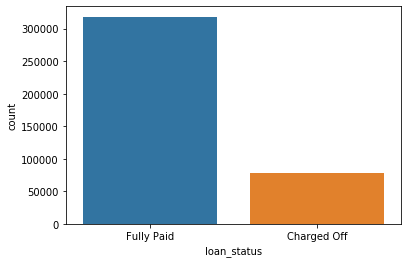
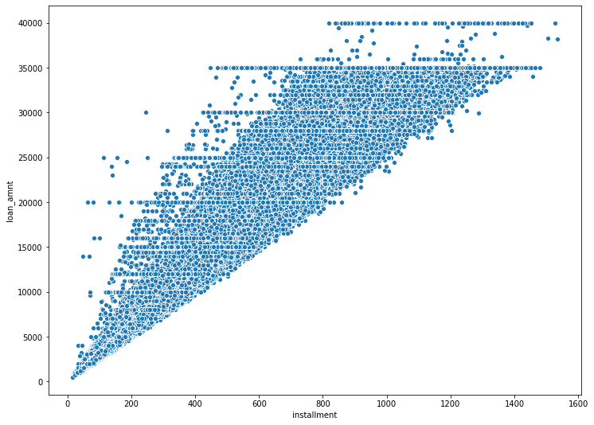

# Keras API Project Exercise

## The Data

We will be using a subset of the LendingClub DataSet obtained from Kaggle: https://www.kaggle.com/wordsforthewise/lending-club

## NOTE: Do not download the full zip from the link! We provide a special version of this file that has some extra feature engineering for you to do. You won't be able to follow along with the original file!

LendingClub is a US peer-to-peer lending company, headquartered in San Francisco, California.[3] It was the first peer-to-peer lender to register its offerings as securities with the Securities and Exchange Commission (SEC), and to offer loan trading on a secondary market. LendingClub is the world's largest peer-to-peer lending platform.

### Our Goal

Given historical data on loans given out with information on whether or not the borrower defaulted (charge-off), can we build a model thatcan predict wether or nor a borrower will pay back their loan? This way in the future when we get a new potential customer we can assess whether or not they are likely to pay back the loan. Keep in mind classification metrics when evaluating the performance of your model!

The "loan_status" column contains our label.

### Data Overview

----
-----
There are many LendingClub data sets on Kaggle. Here is the information on this particular data set:

<table border="1" class="dataframe">
  <thead>
    <tr style="text-align: right;">
      <th></th>
      <th>LoanStatNew</th>
      <th>Description</th>
    </tr>
  </thead>
  <tbody>
    <tr>
      <th>0</th>
      <td>loan_amnt</td>
      <td>The listed amount of the loan applied for by the borrower. If at some point in time, the credit department reduces the loan amount, then it will be reflected in this value.</td>
    </tr>
    <tr>
      <th>1</th>
      <td>term</td>
      <td>The number of payments on the loan. Values are in months and can be either 36 or 60.</td>
    </tr>
    <tr>
      <th>2</th>
      <td>int_rate</td>
      <td>Interest Rate on the loan</td>
    </tr>
    <tr>
      <th>3</th>
      <td>installment</td>
      <td>The monthly payment owed by the borrower if the loan originates.</td>
    </tr>
    <tr>
      <th>4</th>
      <td>grade</td>
      <td>LC assigned loan grade</td>
    </tr>
    <tr>
      <th>5</th>
      <td>sub_grade</td>
      <td>LC assigned loan subgrade</td>
    </tr>
    <tr>
      <th>6</th>
      <td>emp_title</td>
      <td>The job title supplied by the Borrower when applying for the loan.*</td>
    </tr>
    <tr>
      <th>7</th>
      <td>emp_length</td>
      <td>Employment length in years. Possible values are between 0 and 10 where 0 means less than one year and 10 means ten or more years.</td>
    </tr>
    <tr>
      <th>8</th>
      <td>home_ownership</td>
      <td>The home ownership status provided by the borrower during registration or obtained from the credit report. Our values are: RENT, OWN, MORTGAGE, OTHER</td>
    </tr>
    <tr>
      <th>9</th>
      <td>annual_inc</td>
      <td>The self-reported annual income provided by the borrower during registration.</td>
    </tr>
    <tr>
      <th>10</th>
      <td>verification_status</td>
      <td>Indicates if income was verified by LC, not verified, or if the income source was verified</td>
    </tr>
    <tr>
      <th>11</th>
      <td>issue_d</td>
      <td>The month which the loan was funded</td>
    </tr>
    <tr>
      <th>12</th>
      <td>loan_status</td>
      <td>Current status of the loan</td>
    </tr>
    <tr>
      <th>13</th>
      <td>purpose</td>
      <td>A category provided by the borrower for the loan request.</td>
    </tr>
    <tr>
      <th>14</th>
      <td>title</td>
      <td>The loan title provided by the borrower</td>
    </tr>
    <tr>
      <th>15</th>
      <td>zip_code</td>
      <td>The first 3 numbers of the zip code provided by the borrower in the loan application.</td>
    </tr>
    <tr>
      <th>16</th>
      <td>addr_state</td>
      <td>The state provided by the borrower in the loan application</td>
    </tr>
    <tr>
      <th>17</th>
      <td>dti</td>
      <td>A ratio calculated using the borrower’s total monthly debt payments on the total debt obligations, excluding mortgage and the requested LC loan, divided by the borrower’s self-reported monthly income.</td>
    </tr>
    <tr>
      <th>18</th>
      <td>earliest_cr_line</td>
      <td>The month the borrower's earliest reported credit line was opened</td>
    </tr>
    <tr>
      <th>19</th>
      <td>open_acc</td>
      <td>The number of open credit lines in the borrower's credit file.</td>
    </tr>
    <tr>
      <th>20</th>
      <td>pub_rec</td>
      <td>Number of derogatory public records</td>
    </tr>
    <tr>
      <th>21</th>
      <td>revol_bal</td>
      <td>Total credit revolving balance</td>
    </tr>
    <tr>
      <th>22</th>
      <td>revol_util</td>
      <td>Revolving line utilization rate, or the amount of credit the borrower is using relative to all available revolving credit.</td>
    </tr>
    <tr>
      <th>23</th>
      <td>total_acc</td>
      <td>The total number of credit lines currently in the borrower's credit file</td>
    </tr>
    <tr>
      <th>24</th>
      <td>initial_list_status</td>
      <td>The initial listing status of the loan. Possible values are – W, F</td>
    </tr>
    <tr>
      <th>25</th>
      <td>application_type</td>
      <td>Indicates whether the loan is an individual application or a joint application with two co-borrowers</td>
    </tr>
    <tr>
      <th>26</th>
      <td>mort_acc</td>
      <td>Number of mortgage accounts.</td>
    </tr>
    <tr>
      <th>27</th>
      <td>pub_rec_bankruptcies</td>
      <td>Number of public record bankruptcies</td>
    </tr>
  </tbody>
</table>

---
----

## Starter Code

#### Note: We also provide feature information on the data as a .csv file for easy lookup throughout the notebook:


```python
import pandas as pd
```


```python
data_info = pd.read_csv('../DATA/lending_club_info.csv',index_col='LoanStatNew')
```


```python
print(data_info.loc['revol_util']['Description'])
```

    Revolving line utilization rate, or the amount of credit the borrower is using relative to all available revolving credit.
    


```python
def feat_info(col_name):
    print(data_info.loc[col_name]['Description'])
```


```python
feat_info('mort_acc')
```

    Number of mortgage accounts.
    

## Loading the data and other imports


```python
import pandas as pd
import numpy as np
import matplotlib.pyplot as plt
import seaborn as sns

# might be needed depending on your version of Jupyter
%matplotlib inline
```


```python
df = pd.read_csv('../DATA/lending_club_loan_two.csv')
```


```python
df.info()
```

    <class 'pandas.core.frame.DataFrame'>
    RangeIndex: 396030 entries, 0 to 396029
    Data columns (total 27 columns):
    loan_amnt               396030 non-null float64
    term                    396030 non-null object
    int_rate                396030 non-null float64
    installment             396030 non-null float64
    grade                   396030 non-null object
    sub_grade               396030 non-null object
    emp_title               373103 non-null object
    emp_length              377729 non-null object
    home_ownership          396030 non-null object
    annual_inc              396030 non-null float64
    verification_status     396030 non-null object
    issue_d                 396030 non-null object
    loan_status             396030 non-null object
    purpose                 396030 non-null object
    title                   394275 non-null object
    dti                     396030 non-null float64
    earliest_cr_line        396030 non-null object
    open_acc                396030 non-null float64
    pub_rec                 396030 non-null float64
    revol_bal               396030 non-null float64
    revol_util              395754 non-null float64
    total_acc               396030 non-null float64
    initial_list_status     396030 non-null object
    application_type        396030 non-null object
    mort_acc                358235 non-null float64
    pub_rec_bankruptcies    395495 non-null float64
    address                 396030 non-null object
    dtypes: float64(12), object(15)
    memory usage: 81.6+ MB
    

# Project Tasks

**Complete the tasks below! Keep in mind is usually more than one way to complete the task! Enjoy**

-----
------

# Section 1: Exploratory Data Analysis

**OVERALL GOAL: Get an understanding for which variables are important, view summary statistics, and visualize the data**


----

**TASK: Since we will be attempting to predict loan_status, create a countplot as shown below.**


```python
# CODE HERE
```


```python
sns.countplot(x='loan_status',data=df)
```


    <matplotlib.axes._subplots.AxesSubplot at 0x21060860dc8>





**TASK: Create a histogram of the loan_amnt column.**


```python
# CODE HERE
```


```python
plt.figure(figsize=(12,5))
sns.distplot(df['loan_amnt'],kde=False,bins=40)
```


    <matplotlib.axes._subplots.AxesSubplot at 0x21066886388>


**TASK: Let's explore correlation between the continuous feature variables. Calculate the correlation between all continuous numeric variables using .corr() method.**


```python
# CODE HERE
```


```python
df.corr()
```


<div>
<style scoped>
    .dataframe tbody tr th:only-of-type {
        vertical-align: middle;
    }

    .dataframe tbody tr th {
        vertical-align: top;
    }

    .dataframe thead th {
        text-align: right;
    }
</style>
<table border="1" class="dataframe">
  <thead>
    <tr style="text-align: right;">
      <th></th>
      <th>loan_amnt</th>
      <th>int_rate</th>
      <th>installment</th>
      <th>annual_inc</th>
      <th>dti</th>
      <th>open_acc</th>
      <th>pub_rec</th>
      <th>revol_bal</th>
      <th>revol_util</th>
      <th>total_acc</th>
      <th>mort_acc</th>
      <th>pub_rec_bankruptcies</th>
    </tr>
  </thead>
  <tbody>
    <tr>
      <th>loan_amnt</th>
      <td>1.000000</td>
      <td>0.168921</td>
      <td>0.953929</td>
      <td>0.336887</td>
      <td>0.016636</td>
      <td>0.198556</td>
      <td>-0.077779</td>
      <td>0.328320</td>
      <td>0.099911</td>
      <td>0.223886</td>
      <td>0.222315</td>
      <td>-0.106539</td>
    </tr>
    <tr>
      <th>int_rate</th>
      <td>0.168921</td>
      <td>1.000000</td>
      <td>0.162758</td>
      <td>-0.056771</td>
      <td>0.079038</td>
      <td>0.011649</td>
      <td>0.060986</td>
      <td>-0.011280</td>
      <td>0.293659</td>
      <td>-0.036404</td>
      <td>-0.082583</td>
      <td>0.057450</td>
    </tr>
    <tr>
      <th>installment</th>
      <td>0.953929</td>
      <td>0.162758</td>
      <td>1.000000</td>
      <td>0.330381</td>
      <td>0.015786</td>
      <td>0.188973</td>
      <td>-0.067892</td>
      <td>0.316455</td>
      <td>0.123915</td>
      <td>0.202430</td>
      <td>0.193694</td>
      <td>-0.098628</td>
    </tr>
    <tr>
      <th>annual_inc</th>
      <td>0.336887</td>
      <td>-0.056771</td>
      <td>0.330381</td>
      <td>1.000000</td>
      <td>-0.081685</td>
      <td>0.136150</td>
      <td>-0.013720</td>
      <td>0.299773</td>
      <td>0.027871</td>
      <td>0.193023</td>
      <td>0.236320</td>
      <td>-0.050162</td>
    </tr>
    <tr>
      <th>dti</th>
      <td>0.016636</td>
      <td>0.079038</td>
      <td>0.015786</td>
      <td>-0.081685</td>
      <td>1.000000</td>
      <td>0.136181</td>
      <td>-0.017639</td>
      <td>0.063571</td>
      <td>0.088375</td>
      <td>0.102128</td>
      <td>-0.025439</td>
      <td>-0.014558</td>
    </tr>
    <tr>
      <th>open_acc</th>
      <td>0.198556</td>
      <td>0.011649</td>
      <td>0.188973</td>
      <td>0.136150</td>
      <td>0.136181</td>
      <td>1.000000</td>
      <td>-0.018392</td>
      <td>0.221192</td>
      <td>-0.131420</td>
      <td>0.680728</td>
      <td>0.109205</td>
      <td>-0.027732</td>
    </tr>
    <tr>
      <th>pub_rec</th>
      <td>-0.077779</td>
      <td>0.060986</td>
      <td>-0.067892</td>
      <td>-0.013720</td>
      <td>-0.017639</td>
      <td>-0.018392</td>
      <td>1.000000</td>
      <td>-0.101664</td>
      <td>-0.075910</td>
      <td>0.019723</td>
      <td>0.011552</td>
      <td>0.699408</td>
    </tr>
    <tr>
      <th>revol_bal</th>
      <td>0.328320</td>
      <td>-0.011280</td>
      <td>0.316455</td>
      <td>0.299773</td>
      <td>0.063571</td>
      <td>0.221192</td>
      <td>-0.101664</td>
      <td>1.000000</td>
      <td>0.226346</td>
      <td>0.191616</td>
      <td>0.194925</td>
      <td>-0.124532</td>
    </tr>
    <tr>
      <th>revol_util</th>
      <td>0.099911</td>
      <td>0.293659</td>
      <td>0.123915</td>
      <td>0.027871</td>
      <td>0.088375</td>
      <td>-0.131420</td>
      <td>-0.075910</td>
      <td>0.226346</td>
      <td>1.000000</td>
      <td>-0.104273</td>
      <td>0.007514</td>
      <td>-0.086751</td>
    </tr>
    <tr>
      <th>total_acc</th>
      <td>0.223886</td>
      <td>-0.036404</td>
      <td>0.202430</td>
      <td>0.193023</td>
      <td>0.102128</td>
      <td>0.680728</td>
      <td>0.019723</td>
      <td>0.191616</td>
      <td>-0.104273</td>
      <td>1.000000</td>
      <td>0.381072</td>
      <td>0.042035</td>
    </tr>
    <tr>
      <th>mort_acc</th>
      <td>0.222315</td>
      <td>-0.082583</td>
      <td>0.193694</td>
      <td>0.236320</td>
      <td>-0.025439</td>
      <td>0.109205</td>
      <td>0.011552</td>
      <td>0.194925</td>
      <td>0.007514</td>
      <td>0.381072</td>
      <td>1.000000</td>
      <td>0.027239</td>
    </tr>
    <tr>
      <th>pub_rec_bankruptcies</th>
      <td>-0.106539</td>
      <td>0.057450</td>
      <td>-0.098628</td>
      <td>-0.050162</td>
      <td>-0.014558</td>
      <td>-0.027732</td>
      <td>0.699408</td>
      <td>-0.124532</td>
      <td>-0.086751</td>
      <td>0.042035</td>
      <td>0.027239</td>
      <td>1.000000</td>
    </tr>
  </tbody>
</table>
</div>


**TASK: Visualize this using a heatmap. Depending on your version of matplotlib, you may need to manually adjust the heatmap.**

* [Heatmap info](https://seaborn.pydata.org/generated/seaborn.heatmap.html#seaborn.heatmap)
* [Help with resizing](https://stackoverflow.com/questions/56942670/matplotlib-seaborn-first-and-last-row-cut-in-half-of-heatmap-plot)


```python
# CODE HERE
```


```python
plt.figure(figsize=(12,7))
sns.heatmap(df.corr(),annot=True,cmap='magma')
plt.ylim(10,0)
```


    (10, 0)


**TASK: You should have noticed almost perfect correlation with the "installment" feature. Explore this feature further. Print out their descriptions and perform a scatterplot between them. Does this relationship make sense to you? Do you think there is duplicate information here?**


```python
# CODE HERE
```


```python
feat_info('installment')
```

    The monthly payment owed by the borrower if the loan originates.
    


```python
feat_info('loan_amnt')
```

    The listed amount of the loan applied for by the borrower. If at some point in time, the credit department reduces the loan amount, then it will be reflected in this value.
    


```python
plt.figure(figsize=(12,9))
sns.scatterplot(x='installment',y='loan_amnt',data=df)
```


    <matplotlib.axes._subplots.AxesSubplot at 0x21071c041c8>





**TASK: Create a boxplot showing the relationship between the loan_status and the Loan Amount.**


```python
# CODE HERE
```


```python
plt.figure(figsize=(12,9))
sns.boxplot(x='loan_status', y='loan_amnt',data=df)
```


    <matplotlib.axes._subplots.AxesSubplot at 0x21072299248>


**TASK: Calculate the summary statistics for the loan amount, grouped by the loan_status.**


```python
# CODE HERE
```


```python
df.groupby('loan_status')['loan_amnt'].describe()
```


<div>
<style scoped>
    .dataframe tbody tr th:only-of-type {
        vertical-align: middle;
    }

    .dataframe tbody tr th {
        vertical-align: top;
    }

    .dataframe thead th {
        text-align: right;
    }
</style>
<table border="1" class="dataframe">
  <thead>
    <tr style="text-align: right;">
      <th></th>
      <th>count</th>
      <th>mean</th>
      <th>std</th>
      <th>min</th>
      <th>25%</th>
      <th>50%</th>
      <th>75%</th>
      <th>max</th>
    </tr>
    <tr>
      <th>loan_status</th>
      <th></th>
      <th></th>
      <th></th>
      <th></th>
      <th></th>
      <th></th>
      <th></th>
      <th></th>
    </tr>
  </thead>
  <tbody>
    <tr>
      <th>Charged Off</th>
      <td>77673.0</td>
      <td>15126.300967</td>
      <td>8505.090557</td>
      <td>1000.0</td>
      <td>8525.0</td>
      <td>14000.0</td>
      <td>20000.0</td>
      <td>40000.0</td>
    </tr>
    <tr>
      <th>Fully Paid</th>
      <td>318357.0</td>
      <td>13866.878771</td>
      <td>8302.319699</td>
      <td>500.0</td>
      <td>7500.0</td>
      <td>12000.0</td>
      <td>19225.0</td>
      <td>40000.0</td>
    </tr>
  </tbody>
</table>
</div>


**TASK: Let's explore the Grade and SubGrade columns that LendingClub attributes to the loans. What are the unique possible grades and subgrades?**


```python
# CODE HERE
```


```python
df['grade'].unique()
```


    array(['B', 'A', 'C', 'E', 'D', 'F', 'G'], dtype=object)


```python
df['sub_grade'].unique()
```


    array(['B4', 'B5', 'B3', 'A2', 'C5', 'C3', 'A1', 'B2', 'C1', 'A5', 'E4',
           'A4', 'A3', 'D1', 'C2', 'B1', 'D3', 'D5', 'D2', 'E1', 'E2', 'E5',
           'F4', 'E3', 'D4', 'G1', 'F5', 'G2', 'C4', 'F1', 'F3', 'G5', 'G4',
           'F2', 'G3'], dtype=object)


**TASK: Create a countplot per grade. Set the hue to the loan_status label.**


```python
# CODE HERE
```


```python
plt.figure(figsize=(12,9))
sns.countplot(x='grade',hue='loan_status',data=df)
```


    <matplotlib.axes._subplots.AxesSubplot at 0x21072683f88>


**TASK: Display a count plot per subgrade. You may need to resize for this plot and [reorder](https://seaborn.pydata.org/generated/seaborn.countplot.html#seaborn.countplot) the x axis. Feel free to edit the color palette. Explore both all loans made per subgrade as well being separated based on the loan_status. After creating this plot, go ahead and create a similar plot, but set hue="loan_status"**


```python
#CODE HERE
```


```python
plt.figure(figsize=(12,4))
sub_order = sorted(df['sub_grade'].unique())
sns.countplot(x='sub_grade',data=df,order=sub_order,palette='coolwarm')
```


    <matplotlib.axes._subplots.AxesSubplot at 0x21072b1f4c8>


```python

```


```python
plt.figure(figsize=(12,4))
sub_order = sorted(df['sub_grade'].unique())
sns.countplot(x='sub_grade',data=df,order=sub_order,palette='coolwarm',hue='loan_status')
```


    <matplotlib.axes._subplots.AxesSubplot at 0x21072c25948>


```python

```

**TASK: It looks like F and G subgrades don't get paid back that often. Isloate those and recreate the countplot just for those subgrades.**


```python
# CODE HERE
```


```python
fg = df[(df['grade'] == 'G') | (df['grade']=='F')]
plt.figure(figsize=(12,9))
sns.countplot(x='grade',hue='loan_status',data=fg)
```


    <matplotlib.axes._subplots.AxesSubplot at 0x2107109c348>


```python
plt.figure(figsize=(12,4))
sub_order = sorted(fg['sub_grade'].unique())
sns.countplot(x='sub_grade',data=fg,order=sub_order,palette='coolwarm',hue='loan_status')
```


    <matplotlib.axes._subplots.AxesSubplot at 0x210710d0588>


```python

```

**TASK: Create a new column called 'loan_repaid' which will contain a 1 if the loan status was "Fully Paid" and a 0 if it was "Charged Off".**


```python
# CODE HERE
```


```python
df['loan_repaid'] = df['loan_status'].map({'Fully Paid': 1, 'Charged Off':0})
```


```python
df[['loan_repaid','loan_status']]
```


<div>
<style scoped>
    .dataframe tbody tr th:only-of-type {
        vertical-align: middle;
    }

    .dataframe tbody tr th {
        vertical-align: top;
    }

    .dataframe thead th {
        text-align: right;
    }
</style>
<table border="1" class="dataframe">
  <thead>
    <tr style="text-align: right;">
      <th></th>
      <th>loan_repaid</th>
      <th>loan_status</th>
    </tr>
  </thead>
  <tbody>
    <tr>
      <th>0</th>
      <td>1</td>
      <td>Fully Paid</td>
    </tr>
    <tr>
      <th>1</th>
      <td>1</td>
      <td>Fully Paid</td>
    </tr>
    <tr>
      <th>2</th>
      <td>1</td>
      <td>Fully Paid</td>
    </tr>
    <tr>
      <th>3</th>
      <td>1</td>
      <td>Fully Paid</td>
    </tr>
    <tr>
      <th>4</th>
      <td>0</td>
      <td>Charged Off</td>
    </tr>
    <tr>
      <th>...</th>
      <td>...</td>
      <td>...</td>
    </tr>
    <tr>
      <th>396025</th>
      <td>1</td>
      <td>Fully Paid</td>
    </tr>
    <tr>
      <th>396026</th>
      <td>1</td>
      <td>Fully Paid</td>
    </tr>
    <tr>
      <th>396027</th>
      <td>1</td>
      <td>Fully Paid</td>
    </tr>
    <tr>
      <th>396028</th>
      <td>1</td>
      <td>Fully Paid</td>
    </tr>
    <tr>
      <th>396029</th>
      <td>1</td>
      <td>Fully Paid</td>
    </tr>
  </tbody>
</table>
<p>396030 rows × 2 columns</p>
</div>


```python
df.corr()['loan_repaid']
```


    loan_amnt              -0.059836
    int_rate               -0.247758
    installment            -0.041082
    annual_inc              0.053432
    dti                    -0.062413
    open_acc               -0.028012
    pub_rec                -0.019933
    revol_bal               0.010892
    revol_util             -0.082373
    total_acc               0.017893
    mort_acc                0.073111
    pub_rec_bankruptcies   -0.009383
    loan_repaid             1.000000
    Name: loan_repaid, dtype: float64


**CHALLENGE TASK: (Note this is hard, but can be done in one line!) Create a bar plot showing the correlation of the numeric features to the new loan_repaid column. [Helpful Link](https://pandas.pydata.org/pandas-docs/stable/reference/api/pandas.DataFrame.plot.bar.html)**


```python
#CODE HERE
```


```python
df.corr()['loan_repaid'].sort_values().drop('loan_repaid').plot(kind='bar')
```


    <matplotlib.axes._subplots.AxesSubplot at 0x210731d1048>


---
---
# Section 2: Data PreProcessing

**Section Goals: Remove or fill any missing data. Remove unnecessary or repetitive features. Convert categorical string features to dummy variables.**


```python
df.isnull()
```


<div>
<style scoped>
    .dataframe tbody tr th:only-of-type {
        vertical-align: middle;
    }

    .dataframe tbody tr th {
        vertical-align: top;
    }

    .dataframe thead th {
        text-align: right;
    }
</style>
<table border="1" class="dataframe">
  <thead>
    <tr style="text-align: right;">
      <th></th>
      <th>loan_amnt</th>
      <th>term</th>
      <th>int_rate</th>
      <th>installment</th>
      <th>grade</th>
      <th>sub_grade</th>
      <th>emp_title</th>
      <th>emp_length</th>
      <th>home_ownership</th>
      <th>annual_inc</th>
      <th>...</th>
      <th>pub_rec</th>
      <th>revol_bal</th>
      <th>revol_util</th>
      <th>total_acc</th>
      <th>initial_list_status</th>
      <th>application_type</th>
      <th>mort_acc</th>
      <th>pub_rec_bankruptcies</th>
      <th>address</th>
      <th>loan_repaid</th>
    </tr>
  </thead>
  <tbody>
    <tr>
      <th>0</th>
      <td>False</td>
      <td>False</td>
      <td>False</td>
      <td>False</td>
      <td>False</td>
      <td>False</td>
      <td>False</td>
      <td>False</td>
      <td>False</td>
      <td>False</td>
      <td>...</td>
      <td>False</td>
      <td>False</td>
      <td>False</td>
      <td>False</td>
      <td>False</td>
      <td>False</td>
      <td>False</td>
      <td>False</td>
      <td>False</td>
      <td>False</td>
    </tr>
    <tr>
      <th>1</th>
      <td>False</td>
      <td>False</td>
      <td>False</td>
      <td>False</td>
      <td>False</td>
      <td>False</td>
      <td>False</td>
      <td>False</td>
      <td>False</td>
      <td>False</td>
      <td>...</td>
      <td>False</td>
      <td>False</td>
      <td>False</td>
      <td>False</td>
      <td>False</td>
      <td>False</td>
      <td>False</td>
      <td>False</td>
      <td>False</td>
      <td>False</td>
    </tr>
    <tr>
      <th>2</th>
      <td>False</td>
      <td>False</td>
      <td>False</td>
      <td>False</td>
      <td>False</td>
      <td>False</td>
      <td>False</td>
      <td>False</td>
      <td>False</td>
      <td>False</td>
      <td>...</td>
      <td>False</td>
      <td>False</td>
      <td>False</td>
      <td>False</td>
      <td>False</td>
      <td>False</td>
      <td>False</td>
      <td>False</td>
      <td>False</td>
      <td>False</td>
    </tr>
    <tr>
      <th>3</th>
      <td>False</td>
      <td>False</td>
      <td>False</td>
      <td>False</td>
      <td>False</td>
      <td>False</td>
      <td>False</td>
      <td>False</td>
      <td>False</td>
      <td>False</td>
      <td>...</td>
      <td>False</td>
      <td>False</td>
      <td>False</td>
      <td>False</td>
      <td>False</td>
      <td>False</td>
      <td>False</td>
      <td>False</td>
      <td>False</td>
      <td>False</td>
    </tr>
    <tr>
      <th>4</th>
      <td>False</td>
      <td>False</td>
      <td>False</td>
      <td>False</td>
      <td>False</td>
      <td>False</td>
      <td>False</td>
      <td>False</td>
      <td>False</td>
      <td>False</td>
      <td>...</td>
      <td>False</td>
      <td>False</td>
      <td>False</td>
      <td>False</td>
      <td>False</td>
      <td>False</td>
      <td>False</td>
      <td>False</td>
      <td>False</td>
      <td>False</td>
    </tr>
    <tr>
      <th>...</th>
      <td>...</td>
      <td>...</td>
      <td>...</td>
      <td>...</td>
      <td>...</td>
      <td>...</td>
      <td>...</td>
      <td>...</td>
      <td>...</td>
      <td>...</td>
      <td>...</td>
      <td>...</td>
      <td>...</td>
      <td>...</td>
      <td>...</td>
      <td>...</td>
      <td>...</td>
      <td>...</td>
      <td>...</td>
      <td>...</td>
      <td>...</td>
    </tr>
    <tr>
      <th>396025</th>
      <td>False</td>
      <td>False</td>
      <td>False</td>
      <td>False</td>
      <td>False</td>
      <td>False</td>
      <td>False</td>
      <td>False</td>
      <td>False</td>
      <td>False</td>
      <td>...</td>
      <td>False</td>
      <td>False</td>
      <td>False</td>
      <td>False</td>
      <td>False</td>
      <td>False</td>
      <td>False</td>
      <td>False</td>
      <td>False</td>
      <td>False</td>
    </tr>
    <tr>
      <th>396026</th>
      <td>False</td>
      <td>False</td>
      <td>False</td>
      <td>False</td>
      <td>False</td>
      <td>False</td>
      <td>False</td>
      <td>False</td>
      <td>False</td>
      <td>False</td>
      <td>...</td>
      <td>False</td>
      <td>False</td>
      <td>False</td>
      <td>False</td>
      <td>False</td>
      <td>False</td>
      <td>False</td>
      <td>False</td>
      <td>False</td>
      <td>False</td>
    </tr>
    <tr>
      <th>396027</th>
      <td>False</td>
      <td>False</td>
      <td>False</td>
      <td>False</td>
      <td>False</td>
      <td>False</td>
      <td>False</td>
      <td>False</td>
      <td>False</td>
      <td>False</td>
      <td>...</td>
      <td>False</td>
      <td>False</td>
      <td>False</td>
      <td>False</td>
      <td>False</td>
      <td>False</td>
      <td>False</td>
      <td>False</td>
      <td>False</td>
      <td>False</td>
    </tr>
    <tr>
      <th>396028</th>
      <td>False</td>
      <td>False</td>
      <td>False</td>
      <td>False</td>
      <td>False</td>
      <td>False</td>
      <td>False</td>
      <td>False</td>
      <td>False</td>
      <td>False</td>
      <td>...</td>
      <td>False</td>
      <td>False</td>
      <td>False</td>
      <td>False</td>
      <td>False</td>
      <td>False</td>
      <td>False</td>
      <td>False</td>
      <td>False</td>
      <td>False</td>
    </tr>
    <tr>
      <th>396029</th>
      <td>False</td>
      <td>False</td>
      <td>False</td>
      <td>False</td>
      <td>False</td>
      <td>False</td>
      <td>False</td>
      <td>False</td>
      <td>False</td>
      <td>False</td>
      <td>...</td>
      <td>False</td>
      <td>False</td>
      <td>False</td>
      <td>False</td>
      <td>False</td>
      <td>False</td>
      <td>True</td>
      <td>False</td>
      <td>False</td>
      <td>False</td>
    </tr>
  </tbody>
</table>
<p>396030 rows × 28 columns</p>
</div>


```python

```

# Missing Data

**Let's explore this missing data columns. We use a variety of factors to decide whether or not they would be useful, to see if we should keep, discard, or fill in the missing data.**

**TASK: What is the length of the dataframe?**


```python
# CODE HERE
```


```python
len(df)
```


    396030


**TASK: Create a Series that displays the total count of missing values per column.**


```python
# CODE HERE
```


```python
df.isnull().sum()
```


    loan_amnt                   0
    term                        0
    int_rate                    0
    installment                 0
    grade                       0
    sub_grade                   0
    emp_title               22927
    emp_length              18301
    home_ownership              0
    annual_inc                  0
    verification_status         0
    issue_d                     0
    loan_status                 0
    purpose                     0
    title                    1755
    dti                         0
    earliest_cr_line            0
    open_acc                    0
    pub_rec                     0
    revol_bal                   0
    revol_util                276
    total_acc                   0
    initial_list_status         0
    application_type            0
    mort_acc                37795
    pub_rec_bankruptcies      535
    address                     0
    loan_repaid                 0
    dtype: int64


**TASK: Convert this Series to be in term of percentage of the total DataFrame**


```python
# CODE HERE
```


```python
100*df.isnull().sum()/len(df)
```


    loan_amnt               0.000000
    term                    0.000000
    int_rate                0.000000
    installment             0.000000
    grade                   0.000000
    sub_grade               0.000000
    emp_title               5.789208
    emp_length              4.621115
    home_ownership          0.000000
    annual_inc              0.000000
    verification_status     0.000000
    issue_d                 0.000000
    loan_status             0.000000
    purpose                 0.000000
    title                   0.443148
    dti                     0.000000
    earliest_cr_line        0.000000
    open_acc                0.000000
    pub_rec                 0.000000
    revol_bal               0.000000
    revol_util              0.069692
    total_acc               0.000000
    initial_list_status     0.000000
    application_type        0.000000
    mort_acc                9.543469
    pub_rec_bankruptcies    0.135091
    address                 0.000000
    loan_repaid             0.000000
    dtype: float64


**TASK: Let's examine emp_title and emp_length to see whether it will be okay to drop them. Print out their feature information using the feat_info() function from the top of this notebook.**


```python
# CODE HERE
```


```python
feat_info('emp_title')
```

    The job title supplied by the Borrower when applying for the loan.*
    


```python
feat_info('emp_length')
```

    Employment length in years. Possible values are between 0 and 10 where 0 means less than one year and 10 means ten or more years. 
    

**TASK: How many unique employment job titles are there?**


```python
# CODE HERE
```


```python
df['emp_title'].nunique()
```


    173105


```python
df['emp_title'].value_counts()
```


    Teacher                            4389
    Manager                            4250
    Registered Nurse                   1856
    RN                                 1846
    Supervisor                         1830
                                       ... 
    St Peters Healthcare Partners         1
    Software Support Supervisor           1
    Dreyers Grand Ice Cream               1
    Husqvarna Outdoor Product             1
    Interactive Motion Technologies       1
    Name: emp_title, Length: 173105, dtype: int64


**TASK: Realistically there are too many unique job titles to try to convert this to a dummy variable feature. Let's remove that emp_title column.**


```python
# CODE HERE
```


```python
df.drop('emp_title',axis=1,inplace=True)
```

**TASK: Create a count plot of the emp_length feature column. Challenge: Sort the order of the values.**


```python
# CODE HERE
```


```python
sorted (df['emp_length'].dropna().unique())
```


    ['1 year',
     '10+ years',
     '2 years',
     '3 years',
     '4 years',
     '5 years',
     '6 years',
     '7 years',
     '8 years',
     '9 years',
     '< 1 year']


Creating a list for the order above as < year and 10+ years need their locations swapping


```python
emp_len_order = ['1 year',
 '< 1 year',
 '2 years',
 '3 years',
 '4 years',
 '5 years',
 '6 years',
 '7 years',
 '8 years',
 '9 years',
 '10+ years']
```


```python
plt.figure(figsize=(12,4))
sns.countplot(x='emp_length',data=df,order=emp_len_order,palette='coolwarm')
```


    <matplotlib.axes._subplots.AxesSubplot at 0x210731ca348>


**TASK: Plot out the countplot with a hue separating Fully Paid vs Charged Off**


```python
# CODE HERE
```


```python
plt.figure(figsize=(12,4))
sns.countplot(x='emp_length',data=df,order=emp_len_order,hue='loan_status')
```


    <matplotlib.axes._subplots.AxesSubplot at 0x210732fd848>


**CHALLENGE TASK: This still doesn't really inform us if there is a strong relationship between employment length and being charged off, what we want is the percentage of charge offs per category. Essentially informing us what percent of people per employment category didn't pay back their loan. There are a multitude of ways to create this Series. Once you've created it, see if visualize it with a [bar plot](https://pandas.pydata.org/pandas-docs/version/0.23.4/generated/pandas.DataFrame.plot.html). This may be tricky, refer to solutions if you get stuck on creating this Series.**


```python
# CODE HERE
```


```python
emp_co = df[df['loan_status']=='Charged Off'].groupby('emp_length').count()['loan_status']
```


```python
emp_fp = df[df['loan_status']=='Fully Paid'].groupby('emp_length').count()['loan_status']
```


```python

            
```


```python
emp_co_ratio = emp_co/emp_fp
emp_co_ratio
```


    emp_length
    1 year       0.248649
    10+ years    0.225770
    2 years      0.239560
    3 years      0.242593
    4 years      0.238213
    5 years      0.237911
    6 years      0.233341
    7 years      0.241887
    8 years      0.249625
    9 years      0.250735
    < 1 year     0.260830
    Name: loan_status, dtype: float64


```python
emp_co_perc = (emp_co/(emp_co+emp_fp))*100
emp_co_perc 
```


    emp_length
    1 year       19.913453
    10+ years    18.418610
    2 years      19.326206
    3 years      19.523133
    4 years      19.238477
    5 years      19.218721
    6 years      18.919438
    7 years      19.477400
    8 years      19.976002
    9 years      20.047016
    < 1 year     20.687155
    Name: loan_status, dtype: float64


```python
emp_co_perc.plot(kind='bar')
```


    <matplotlib.axes._subplots.AxesSubplot at 0x21074c07048>


**TASK: Charge off rates are extremely similar across all employment lengths. Go ahead and drop the emp_length column.**


```python
# CODE HERE
```


```python
df.drop('emp_length', axis=1, inplace=True)
```

**TASK: Revisit the DataFrame to see what feature columns still have missing data.**


```python
df.isnull().sum()
```


    loan_amnt                   0
    term                        0
    int_rate                    0
    installment                 0
    grade                       0
    sub_grade                   0
    home_ownership              0
    annual_inc                  0
    verification_status         0
    issue_d                     0
    loan_status                 0
    purpose                     0
    title                    1755
    dti                         0
    earliest_cr_line            0
    open_acc                    0
    pub_rec                     0
    revol_bal                   0
    revol_util                276
    total_acc                   0
    initial_list_status         0
    application_type            0
    mort_acc                37795
    pub_rec_bankruptcies      535
    address                     0
    loan_repaid                 0
    dtype: int64


```python

```

**TASK: Review the title column vs the purpose column. Is this repeated information?**


```python
# CODE HERE
```


```python
df['purpose'].head(10)
```


    0              vacation
    1    debt_consolidation
    2           credit_card
    3           credit_card
    4           credit_card
    5    debt_consolidation
    6      home_improvement
    7           credit_card
    8    debt_consolidation
    9    debt_consolidation
    Name: purpose, dtype: object


```python
df['title'].head(10)
```


    0                   Vacation
    1         Debt consolidation
    2    Credit card refinancing
    3    Credit card refinancing
    4      Credit Card Refinance
    5         Debt consolidation
    6           Home improvement
    7       No More Credit Cards
    8         Debt consolidation
    9         Debt Consolidation
    Name: title, dtype: object


**TASK: The title column is simply a string subcategory/description of the purpose column. Go ahead and drop the title column.**


```python
# CODE HERE
```


```python
df.drop('title',axis=1, inplace=True)
```

---
**NOTE: This is one of the hardest parts of the project! Refer to the solutions video if you need guidance, feel free to fill or drop the missing values of the mort_acc however you see fit! Here we're going with a very specific approach.**


---
**TASK: Find out what the mort_acc feature represents**


```python
# CODE HERE
```


```python
feat_info('mort_acc')
```

    Number of mortgage accounts.
    

**TASK: Create a value_counts of the mort_acc column.**


```python
# CODE HERE
```


```python
df['mort_acc'].value_counts()
```


    0.0     139777
    1.0      60416
    2.0      49948
    3.0      38049
    4.0      27887
    5.0      18194
    6.0      11069
    7.0       6052
    8.0       3121
    9.0       1656
    10.0       865
    11.0       479
    12.0       264
    13.0       146
    14.0       107
    15.0        61
    16.0        37
    17.0        22
    18.0        18
    19.0        15
    20.0        13
    24.0        10
    22.0         7
    21.0         4
    25.0         4
    27.0         3
    23.0         2
    32.0         2
    26.0         2
    31.0         2
    30.0         1
    28.0         1
    34.0         1
    Name: mort_acc, dtype: int64


**TASK: There are many ways we could deal with this missing data. We could attempt to build a simple model to fill it in, such as a linear model, we could just fill it in based on the mean of the other columns, or you could even bin the columns into categories and then set NaN as its own category. There is no 100% correct approach! Let's review the other columsn to see which most highly correlates to mort_acc**


```python

```


```python
df.corr()['mort_acc'].sort_values()
```


    int_rate               -0.082583
    dti                    -0.025439
    revol_util              0.007514
    pub_rec                 0.011552
    pub_rec_bankruptcies    0.027239
    loan_repaid             0.073111
    open_acc                0.109205
    installment             0.193694
    revol_bal               0.194925
    loan_amnt               0.222315
    annual_inc              0.236320
    total_acc               0.381072
    mort_acc                1.000000
    Name: mort_acc, dtype: float64


**TASK: Looks like the total_acc feature correlates with the mort_acc , this makes sense! Let's try this fillna() approach. We will group the dataframe by the total_acc and calculate the mean value for the mort_acc per total_acc entry. To get the result below:**


```python
tot_mort = df.groupby('total_acc').mean()['mort_acc']
tot_mort
```


    total_acc
    2.0      0.000000
    3.0      0.052023
    4.0      0.066743
    5.0      0.103289
    6.0      0.151293
               ...   
    124.0    1.000000
    129.0    1.000000
    135.0    3.000000
    150.0    2.000000
    151.0    0.000000
    Name: mort_acc, Length: 118, dtype: float64


```python
tot_mort.plot()
```


    <matplotlib.axes._subplots.AxesSubplot at 0x210189c0dc8>


**CHALLENGE TASK: Let's fill in the missing mort_acc values based on their total_acc value. If the mort_acc is missing, then we will fill in that missing value with the mean value corresponding to its total_acc value from the Series we created above. This involves using an .apply() method with two columns. Check out the link below for more info, or review the solutions video/notebook.**

[Helpful Link](https://stackoverflow.com/questions/13331698/how-to-apply-a-function-to-two-columns-of-pandas-dataframe) 


```python
# CODE HERE
```


```python
def fill_mort_acc(total_acc,mort_acc):
    
    if np.isnan(mort_acc):
        return tot_mort[total_acc]
    else:
        return mort_acc
```


```python
df['mort_acc']=df.apply(lambda x: fill_mort_acc(x['total_acc'],x['mort_acc']),axis=1)
```


```python

```


```python

```


```python
df.isnull().sum()
```


    loan_amnt                 0
    term                      0
    int_rate                  0
    installment               0
    grade                     0
    sub_grade                 0
    home_ownership            0
    annual_inc                0
    verification_status       0
    issue_d                   0
    loan_status               0
    purpose                   0
    dti                       0
    earliest_cr_line          0
    open_acc                  0
    pub_rec                   0
    revol_bal                 0
    revol_util              276
    total_acc                 0
    initial_list_status       0
    application_type          0
    mort_acc                  0
    pub_rec_bankruptcies    535
    address                   0
    loan_repaid               0
    dtype: int64


**TASK: revol_util and the pub_rec_bankruptcies have missing data points, but they account for less than 0.5% of the total data. Go ahead and remove the rows that are missing those values in those columns with dropna().**


```python
# CODE HERE
```


```python
df = df.dropna()
```


```python
df2 =df.copy()
```


```python
df3=df.copy()
```


```python
df.isnull().sum()
```


    loan_amnt               0
    term                    0
    int_rate                0
    installment             0
    grade                   0
    sub_grade               0
    home_ownership          0
    annual_inc              0
    verification_status     0
    issue_d                 0
    loan_status             0
    purpose                 0
    dti                     0
    earliest_cr_line        0
    open_acc                0
    pub_rec                 0
    revol_bal               0
    revol_util              0
    total_acc               0
    initial_list_status     0
    application_type        0
    mort_acc                0
    pub_rec_bankruptcies    0
    address                 0
    loan_repaid             0
    dtype: int64


## Categorical Variables and Dummy Variables

**We're done working with the missing data! Now we just need to deal with the string values due to the categorical columns.**

**TASK: List all the columns that are currently non-numeric. [Helpful Link](https://stackoverflow.com/questions/22470690/get-list-of-pandas-dataframe-columns-based-on-data-type)**

[Another very useful method call](https://pandas.pydata.org/pandas-docs/stable/reference/api/pandas.DataFrame.select_dtypes.html)


```python
# CODE HERE
```


```python
df.select_dtypes(include='object').columns
```


    Index(['term', 'grade', 'sub_grade', 'home_ownership', 'verification_status',
           'issue_d', 'loan_status', 'purpose', 'earliest_cr_line',
           'initial_list_status', 'application_type', 'address'],
          dtype='object')


```python

```


    Index(['term', 'grade', 'sub_grade', 'home_ownership', 'verification_status',
           'issue_d', 'loan_status', 'purpose', 'earliest_cr_line',
           'initial_list_status', 'application_type', 'address'],
          dtype='object')


---
**Let's now go through all the string features to see what we should do with them.**

---


### term feature

**TASK: Convert the term feature into either a 36 or 60 integer numeric data type using .apply() or .map().**


```python
# CODE HERE
```


```python
df['term'].unique()
```


    array([' 36 months', ' 60 months'], dtype=object)


```python
df['term'] = df['term'].apply(lambda term:int(term[:3]))
```


```python
df['term'].unique()
```


    array([36, 60], dtype=int64)


```python
df2['term'].unique()
```


    array([' 36 months', ' 60 months'], dtype=object)


### grade feature

**TASK: We already know grade is part of sub_grade, so just drop the grade feature.**


```python
# CODE HERE
```


```python
#df = df2.copy() - used to restore edited df
```


```python
df.drop('grade',axis=1,inplace=True)
```

**TASK: Convert the subgrade into dummy variables. Then concatenate these new columns to the original dataframe. Remember to drop the original subgrade column and to add drop_first=True to your get_dummies call.**


```python
# CODE HERE
```


```python
dummies = pd.get_dummies(df['sub_grade'],drop_first=True)

df = pd.concat([df.drop('sub_grade',axis=1), dummies],axis=1)
```


```python
dummies.head()
```


<div>
<style scoped>
    .dataframe tbody tr th:only-of-type {
        vertical-align: middle;
    }

    .dataframe tbody tr th {
        vertical-align: top;
    }

    .dataframe thead th {
        text-align: right;
    }
</style>
<table border="1" class="dataframe">
  <thead>
    <tr style="text-align: right;">
      <th></th>
      <th>A2</th>
      <th>A3</th>
      <th>A4</th>
      <th>A5</th>
      <th>B1</th>
      <th>B2</th>
      <th>B3</th>
      <th>B4</th>
      <th>B5</th>
      <th>C1</th>
      <th>...</th>
      <th>F1</th>
      <th>F2</th>
      <th>F3</th>
      <th>F4</th>
      <th>F5</th>
      <th>G1</th>
      <th>G2</th>
      <th>G3</th>
      <th>G4</th>
      <th>G5</th>
    </tr>
  </thead>
  <tbody>
    <tr>
      <th>0</th>
      <td>0</td>
      <td>0</td>
      <td>0</td>
      <td>0</td>
      <td>0</td>
      <td>0</td>
      <td>0</td>
      <td>1</td>
      <td>0</td>
      <td>0</td>
      <td>...</td>
      <td>0</td>
      <td>0</td>
      <td>0</td>
      <td>0</td>
      <td>0</td>
      <td>0</td>
      <td>0</td>
      <td>0</td>
      <td>0</td>
      <td>0</td>
    </tr>
    <tr>
      <th>1</th>
      <td>0</td>
      <td>0</td>
      <td>0</td>
      <td>0</td>
      <td>0</td>
      <td>0</td>
      <td>0</td>
      <td>0</td>
      <td>1</td>
      <td>0</td>
      <td>...</td>
      <td>0</td>
      <td>0</td>
      <td>0</td>
      <td>0</td>
      <td>0</td>
      <td>0</td>
      <td>0</td>
      <td>0</td>
      <td>0</td>
      <td>0</td>
    </tr>
    <tr>
      <th>2</th>
      <td>0</td>
      <td>0</td>
      <td>0</td>
      <td>0</td>
      <td>0</td>
      <td>0</td>
      <td>1</td>
      <td>0</td>
      <td>0</td>
      <td>0</td>
      <td>...</td>
      <td>0</td>
      <td>0</td>
      <td>0</td>
      <td>0</td>
      <td>0</td>
      <td>0</td>
      <td>0</td>
      <td>0</td>
      <td>0</td>
      <td>0</td>
    </tr>
    <tr>
      <th>3</th>
      <td>1</td>
      <td>0</td>
      <td>0</td>
      <td>0</td>
      <td>0</td>
      <td>0</td>
      <td>0</td>
      <td>0</td>
      <td>0</td>
      <td>0</td>
      <td>...</td>
      <td>0</td>
      <td>0</td>
      <td>0</td>
      <td>0</td>
      <td>0</td>
      <td>0</td>
      <td>0</td>
      <td>0</td>
      <td>0</td>
      <td>0</td>
    </tr>
    <tr>
      <th>4</th>
      <td>0</td>
      <td>0</td>
      <td>0</td>
      <td>0</td>
      <td>0</td>
      <td>0</td>
      <td>0</td>
      <td>0</td>
      <td>0</td>
      <td>0</td>
      <td>...</td>
      <td>0</td>
      <td>0</td>
      <td>0</td>
      <td>0</td>
      <td>0</td>
      <td>0</td>
      <td>0</td>
      <td>0</td>
      <td>0</td>
      <td>0</td>
    </tr>
  </tbody>
</table>
<p>5 rows × 34 columns</p>
</div>


```python
df.columns
```


    Index(['loan_amnt', 'term', 'int_rate', 'installment', 'home_ownership',
           'annual_inc', 'verification_status', 'issue_d', 'loan_status',
           'purpose', 'dti', 'earliest_cr_line', 'open_acc', 'pub_rec',
           'revol_bal', 'revol_util', 'total_acc', 'initial_list_status',
           'application_type', 'mort_acc', 'pub_rec_bankruptcies', 'address',
           'loan_repaid', 'A2', 'A3', 'A4', 'A5', 'B1', 'B2', 'B3', 'B4', 'B5',
           'C1', 'C2', 'C3', 'C4', 'C5', 'D1', 'D2', 'D3', 'D4', 'D5', 'E1', 'E2',
           'E3', 'E4', 'E5', 'F1', 'F2', 'F3', 'F4', 'F5', 'G1', 'G2', 'G3', 'G4',
           'G5'],
          dtype='object')


```python
df2 = df.copy()
```


```python
df = df2.copy()
```

### verification_status, application_type,initial_list_status,purpose 
**TASK: Convert these columns: ['verification_status', 'application_type','initial_list_status','purpose'] into dummy variables and concatenate them with the original dataframe. Remember to set drop_first=True and to drop the original columns.**


```python
# CODE HERE
```


```python
set_dummies = pd.get_dummies(df[['verification_status', 'application_type','initial_list_status','purpose']],drop_first=True)


```


```python
set_dummies
```


<div>
<style scoped>
    .dataframe tbody tr th:only-of-type {
        vertical-align: middle;
    }

    .dataframe tbody tr th {
        vertical-align: top;
    }

    .dataframe thead th {
        text-align: right;
    }
</style>
<table border="1" class="dataframe">
  <thead>
    <tr style="text-align: right;">
      <th></th>
      <th>verification_status_Source Verified</th>
      <th>verification_status_Verified</th>
      <th>application_type_INDIVIDUAL</th>
      <th>application_type_JOINT</th>
      <th>initial_list_status_w</th>
      <th>purpose_credit_card</th>
      <th>purpose_debt_consolidation</th>
      <th>purpose_educational</th>
      <th>purpose_home_improvement</th>
      <th>purpose_house</th>
      <th>purpose_major_purchase</th>
      <th>purpose_medical</th>
      <th>purpose_moving</th>
      <th>purpose_other</th>
      <th>purpose_renewable_energy</th>
      <th>purpose_small_business</th>
      <th>purpose_vacation</th>
      <th>purpose_wedding</th>
    </tr>
  </thead>
  <tbody>
    <tr>
      <th>0</th>
      <td>0</td>
      <td>0</td>
      <td>1</td>
      <td>0</td>
      <td>1</td>
      <td>0</td>
      <td>0</td>
      <td>0</td>
      <td>0</td>
      <td>0</td>
      <td>0</td>
      <td>0</td>
      <td>0</td>
      <td>0</td>
      <td>0</td>
      <td>0</td>
      <td>1</td>
      <td>0</td>
    </tr>
    <tr>
      <th>1</th>
      <td>0</td>
      <td>0</td>
      <td>1</td>
      <td>0</td>
      <td>0</td>
      <td>0</td>
      <td>1</td>
      <td>0</td>
      <td>0</td>
      <td>0</td>
      <td>0</td>
      <td>0</td>
      <td>0</td>
      <td>0</td>
      <td>0</td>
      <td>0</td>
      <td>0</td>
      <td>0</td>
    </tr>
    <tr>
      <th>2</th>
      <td>1</td>
      <td>0</td>
      <td>1</td>
      <td>0</td>
      <td>0</td>
      <td>1</td>
      <td>0</td>
      <td>0</td>
      <td>0</td>
      <td>0</td>
      <td>0</td>
      <td>0</td>
      <td>0</td>
      <td>0</td>
      <td>0</td>
      <td>0</td>
      <td>0</td>
      <td>0</td>
    </tr>
    <tr>
      <th>3</th>
      <td>0</td>
      <td>0</td>
      <td>1</td>
      <td>0</td>
      <td>0</td>
      <td>1</td>
      <td>0</td>
      <td>0</td>
      <td>0</td>
      <td>0</td>
      <td>0</td>
      <td>0</td>
      <td>0</td>
      <td>0</td>
      <td>0</td>
      <td>0</td>
      <td>0</td>
      <td>0</td>
    </tr>
    <tr>
      <th>4</th>
      <td>0</td>
      <td>1</td>
      <td>1</td>
      <td>0</td>
      <td>0</td>
      <td>1</td>
      <td>0</td>
      <td>0</td>
      <td>0</td>
      <td>0</td>
      <td>0</td>
      <td>0</td>
      <td>0</td>
      <td>0</td>
      <td>0</td>
      <td>0</td>
      <td>0</td>
      <td>0</td>
    </tr>
    <tr>
      <th>...</th>
      <td>...</td>
      <td>...</td>
      <td>...</td>
      <td>...</td>
      <td>...</td>
      <td>...</td>
      <td>...</td>
      <td>...</td>
      <td>...</td>
      <td>...</td>
      <td>...</td>
      <td>...</td>
      <td>...</td>
      <td>...</td>
      <td>...</td>
      <td>...</td>
      <td>...</td>
      <td>...</td>
    </tr>
    <tr>
      <th>396025</th>
      <td>1</td>
      <td>0</td>
      <td>1</td>
      <td>0</td>
      <td>1</td>
      <td>0</td>
      <td>1</td>
      <td>0</td>
      <td>0</td>
      <td>0</td>
      <td>0</td>
      <td>0</td>
      <td>0</td>
      <td>0</td>
      <td>0</td>
      <td>0</td>
      <td>0</td>
      <td>0</td>
    </tr>
    <tr>
      <th>396026</th>
      <td>1</td>
      <td>0</td>
      <td>1</td>
      <td>0</td>
      <td>0</td>
      <td>0</td>
      <td>1</td>
      <td>0</td>
      <td>0</td>
      <td>0</td>
      <td>0</td>
      <td>0</td>
      <td>0</td>
      <td>0</td>
      <td>0</td>
      <td>0</td>
      <td>0</td>
      <td>0</td>
    </tr>
    <tr>
      <th>396027</th>
      <td>0</td>
      <td>1</td>
      <td>1</td>
      <td>0</td>
      <td>0</td>
      <td>0</td>
      <td>1</td>
      <td>0</td>
      <td>0</td>
      <td>0</td>
      <td>0</td>
      <td>0</td>
      <td>0</td>
      <td>0</td>
      <td>0</td>
      <td>0</td>
      <td>0</td>
      <td>0</td>
    </tr>
    <tr>
      <th>396028</th>
      <td>0</td>
      <td>1</td>
      <td>1</td>
      <td>0</td>
      <td>0</td>
      <td>0</td>
      <td>1</td>
      <td>0</td>
      <td>0</td>
      <td>0</td>
      <td>0</td>
      <td>0</td>
      <td>0</td>
      <td>0</td>
      <td>0</td>
      <td>0</td>
      <td>0</td>
      <td>0</td>
    </tr>
    <tr>
      <th>396029</th>
      <td>0</td>
      <td>1</td>
      <td>1</td>
      <td>0</td>
      <td>0</td>
      <td>0</td>
      <td>1</td>
      <td>0</td>
      <td>0</td>
      <td>0</td>
      <td>0</td>
      <td>0</td>
      <td>0</td>
      <td>0</td>
      <td>0</td>
      <td>0</td>
      <td>0</td>
      <td>0</td>
    </tr>
  </tbody>
</table>
<p>395219 rows × 18 columns</p>
</div>


```python
df = pd.concat([df.drop(['verification_status', 'application_type','initial_list_status','purpose'],axis=1), set_dummies],axis=1)
```


```python
df.columns
```


    Index(['loan_amnt', 'term', 'int_rate', 'installment', 'home_ownership',
           'annual_inc', 'issue_d', 'loan_status', 'dti', 'earliest_cr_line',
           'open_acc', 'pub_rec', 'revol_bal', 'revol_util', 'total_acc',
           'mort_acc', 'pub_rec_bankruptcies', 'address', 'loan_repaid', 'A2',
           'A3', 'A4', 'A5', 'B1', 'B2', 'B3', 'B4', 'B5', 'C1', 'C2', 'C3', 'C4',
           'C5', 'D1', 'D2', 'D3', 'D4', 'D5', 'E1', 'E2', 'E3', 'E4', 'E5', 'F1',
           'F2', 'F3', 'F4', 'F5', 'G1', 'G2', 'G3', 'G4', 'G5',
           'verification_status_Source Verified', 'verification_status_Verified',
           'application_type_INDIVIDUAL', 'application_type_JOINT',
           'initial_list_status_w', 'purpose_credit_card',
           'purpose_debt_consolidation', 'purpose_educational',
           'purpose_home_improvement', 'purpose_house', 'purpose_major_purchase',
           'purpose_medical', 'purpose_moving', 'purpose_other',
           'purpose_renewable_energy', 'purpose_small_business',
           'purpose_vacation', 'purpose_wedding'],
          dtype='object')


### home_ownership
**TASK:Review the value_counts for the home_ownership column.**


```python
#CODE HERE
```


```python
df['home_ownership'].value_counts()
```


    MORTGAGE    198022
    RENT        159395
    OWN          37660
    OTHER          110
    NONE            29
    ANY              3
    Name: home_ownership, dtype: int64


**TASK: Convert these to dummy variables, but [replace](https://pandas.pydata.org/pandas-docs/stable/reference/api/pandas.DataFrame.replace.html) NONE and ANY with OTHER, so that we end up with just 4 categories, MORTGAGE, RENT, OWN, OTHER. Then concatenate them with the original dataframe. Remember to set drop_first=True and to drop the original columns.**


```python
#CODE HERE
```


```python
df['home_ownership'] =  df['home_ownership'].replace(['NONE','ANY'],'OTHER')
```


```python
df['home_ownership'].value_counts()
```


    MORTGAGE    198022
    RENT        159395
    OWN          37660
    OTHER          142
    Name: home_ownership, dtype: int64


```python
home_dummies = pd.get_dummies(df['home_ownership'],drop_first=True)

df = pd.concat([df.drop('home_ownership',axis=1), home_dummies],axis=1)
```


```python
df.columns
```


    Index(['loan_amnt', 'term', 'int_rate', 'installment', 'annual_inc', 'issue_d',
           'loan_status', 'dti', 'earliest_cr_line', 'open_acc', 'pub_rec',
           'revol_bal', 'revol_util', 'total_acc', 'mort_acc',
           'pub_rec_bankruptcies', 'address', 'loan_repaid', 'A2', 'A3', 'A4',
           'A5', 'B1', 'B2', 'B3', 'B4', 'B5', 'C1', 'C2', 'C3', 'C4', 'C5', 'D1',
           'D2', 'D3', 'D4', 'D5', 'E1', 'E2', 'E3', 'E4', 'E5', 'F1', 'F2', 'F3',
           'F4', 'F5', 'G1', 'G2', 'G3', 'G4', 'G5',
           'verification_status_Source Verified', 'verification_status_Verified',
           'application_type_INDIVIDUAL', 'application_type_JOINT',
           'initial_list_status_w', 'purpose_credit_card',
           'purpose_debt_consolidation', 'purpose_educational',
           'purpose_home_improvement', 'purpose_house', 'purpose_major_purchase',
           'purpose_medical', 'purpose_moving', 'purpose_other',
           'purpose_renewable_energy', 'purpose_small_business',
           'purpose_vacation', 'purpose_wedding', 'OTHER', 'OWN', 'RENT'],
          dtype='object')


### address
**TASK: Let's feature engineer a zip code column from the address in the data set. Create a column called 'zip_code' that extracts the zip code from the address column.**


```python
#CODE HERE
```


```python
df['zip_code'] = df['address'].apply(lambda address:address[-5:])
```


```python
df['zip_code'].value_counts()
```


    70466    56880
    22690    56413
    30723    56402
    48052    55811
    00813    45725
    29597    45393
    05113    45300
    11650    11210
    93700    11126
    86630    10959
    Name: zip_code, dtype: int64


**TASK: Now make this zip_code column into dummy variables using pandas. Concatenate the result and drop the original zip_code column along with dropping the address column.**


```python
zip_dummies = pd.get_dummies(df['zip_code'],drop_first=True)

df = pd.concat([df.drop(['zip_code','address'],axis=1), zip_dummies],axis=1)
```


```python

```

### issue_d 

**TASK: This would be data leakage, we wouldn't know beforehand whether or not a loan would be issued when using our model, so in theory we wouldn't have an issue_date, drop this feature.**


```python
#CODE HERE
```


```python
df = df.drop('issue_d',axis=1)
```

### earliest_cr_line
**TASK: This appears to be a historical time stamp feature. Extract the year from this feature using a .apply function, then convert it to a numeric feature. Set this new data to a feature column called 'earliest_cr_year'.Then drop the earliest_cr_line feature.**


```python
#CODE HERE
```


```python
feat_info('earliest_cr_line')
```

    The month the borrower's earliest reported credit line was opened
    


```python
df['earliest_cr_line'].unique()
```


    array([1990, 2004, 2007, 2006, 1999, 2005, 1994, 1997, 1984, 1995, 2001,
           1982, 1996, 2000, 2003, 2008, 1998, 2002, 2009, 1992, 1988, 2010,
           1986, 2012, 1978, 1993, 1983, 1989, 1991, 2011, 1980, 1981, 1987,
           1985, 1967, 1972, 1969, 1979, 1965, 1977, 1974, 1976, 1975, 1971,
           2013, 1964, 1970, 1973, 1963, 1960, 1966, 1961, 1968, 1958, 1955,
           1953, 1959, 1962, 1944, 1956, 1951, 1957, 1950, 1954, 1948],
          dtype=int64)


```python
df['earliest_cr_line'] = df['earliest_cr_line'].apply(lambda date:int(date[-4:]))
```


```python
df['earliest_cr_line']
```


    0         1990
    1         2004
    2         2007
    3         2006
    4         1999
              ... 
    396025    2004
    396026    2006
    396027    1997
    396028    1990
    396029    1998
    Name: earliest_cr_line, Length: 395219, dtype: int64


## Train Test Split

**TASK: Import train_test_split from sklearn.**


```python
from sklearn.model_selection import train_test_split
```

**TASK: drop the load_status column we created earlier, since its a duplicate of the loan_repaid column. We'll use the loan_repaid column since its already in 0s and 1s.**


```python
# CODE HERE
```


```python
df['loan_status'].unique()
```


    array(['Fully Paid', 'Charged Off'], dtype=object)


```python
df.drop('loan_status',axis=1,inplace=True)
```

**TASK: Set X and y variables to the .values of the features and label.**


```python
#CODE HERE
```


```python
X = df.drop('loan_repaid',axis=1).values
y = df['loan_repaid'].values
```

----
----

# OPTIONAL

## Grabbing a Sample for Training Time

### OPTIONAL: Use .sample() to grab a sample of the 490k+ entries to save time on training. Highly recommended for lower RAM computers or if you are not using GPU.

----
----


```python
# df = df.sample(frac=0.1,random_state=101)
print(len(df))
```

    395219
    

**TASK: Perform a train/test split with test_size=0.2 and a random_state of 101.**


```python
#CODE HERE
```


```python
X_train, X_test, y_train, y_test = train_test_split( X, y, test_size=0.2, random_state=101)
```

## Normalizing the Data

**TASK: Use a MinMaxScaler to normalize the feature data X_train and X_test. Recall we don't want data leakge from the test set so we only fit on the X_train data.**


```python
# CODE HERE
```


```python
from sklearn.preprocessing import MinMaxScaler
```


```python
scaler=MinMaxScaler()
```


```python
X_train = scaler.fit_transform(X_train)
```


```python
X_test = scaler.transform(X_test)
```

# Creating the Model

**TASK: Run the cell below to import the necessary Keras functions.**


```python
import tensorflow as tf
from tensorflow.keras.models import Sequential
from tensorflow.keras.layers import Dense,Dropout
```

**TASK: Build a sequential model to will be trained on the data. You have unlimited options here, but here is what the solution uses: a model that goes 78 --> 39 --> 19--> 1 output neuron. OPTIONAL: Explore adding [Dropout layers](https://keras.io/layers/core/) [1](https://en.wikipedia.org/wiki/Dropout_(neural_networks)) [2](https://towardsdatascience.com/machine-learning-part-20-dropout-keras-layers-explained-8c9f6dc4c9ab)**


```python
# CODE HERE
model = Sequential()

model.add(Dense(78,activation='relu'))
model.add(Dropout(0.2))

model.add(Dense(39,activation='relu'))
model.add(Dropout(0.2))

model.add(Dense(19,activation='relu'))
model.add(Dropout(0.2))

model.add(Dense(units=1,activation='sigmoid'))

model.compile(loss='binary_crossentropy',optimizer='adam')


# https://stats.stackexchange.com/questions/181/how-to-choose-the-number-of-hidden-layers-and-nodes-in-a-feedforward-neural-netw


```


```python

```

**TASK: Fit the model to the training data for at least 25 epochs. Also add in the validation data for later plotting. Optional: add in a batch_size of 256.**


```python
# CODE HERE
```


```python
model.fit(x=X_train,y=y_train,epochs=25,batch_size=256,validation_data=(X_test,y_test))
```

    Train on 316175 samples, validate on 79044 samples
    Epoch 1/25
    316175/316175 [==============================] - 20s 64us/sample - loss: 0.3011 - val_loss: 0.2652
    Epoch 2/25
    316175/316175 [==============================] - 15s 47us/sample - loss: 0.2657 - val_loss: 0.2632
    Epoch 3/25
    316175/316175 [==============================] - 13s 41us/sample - loss: 0.2628 - val_loss: 0.2624
    Epoch 4/25
    316175/316175 [==============================] - 18s 57us/sample - loss: 0.2620 - val_loss: 0.2623
    Epoch 5/25
    316175/316175 [==============================] - 17s 54us/sample - loss: 0.2611 - val_loss: 0.2621
    Epoch 6/25
    316175/316175 [==============================] - 15s 48us/sample - loss: 0.2606 - val_loss: 0.2617
    Epoch 7/25
    316175/316175 [==============================] - 13s 41us/sample - loss: 0.2600 - val_loss: 0.2623
    Epoch 8/25
    316175/316175 [==============================] - 18s 57us/sample - loss: 0.2597 - val_loss: 0.2612
    Epoch 9/25
    316175/316175 [==============================] - 20s 63us/sample - loss: 0.2593 - val_loss: 0.2621
    Epoch 10/25
    316175/316175 [==============================] - 14s 45us/sample - loss: 0.2590 - val_loss: 0.2616
    Epoch 11/25
    316175/316175 [==============================] - 15s 49us/sample - loss: 0.2587 - val_loss: 0.2619
    Epoch 12/25
    316175/316175 [==============================] - 17s 52us/sample - loss: 0.2585 - val_loss: 0.2609
    Epoch 13/25
    316175/316175 [==============================] - 16s 50us/sample - loss: 0.2584 - val_loss: 0.2610
    Epoch 14/25
    316175/316175 [==============================] - 15s 46us/sample - loss: 0.2580 - val_loss: 0.2610
    Epoch 15/25
    316175/316175 [==============================] - 15s 48us/sample - loss: 0.2580 - val_loss: 0.2611
    Epoch 16/25
    316175/316175 [==============================] - 21s 68us/sample - loss: 0.2576 - val_loss: 0.2608
    Epoch 17/25
    316175/316175 [==============================] - 18s 58us/sample - loss: 0.2574 - val_loss: 0.2609
    Epoch 18/25
    316175/316175 [==============================] - 20s 64us/sample - loss: 0.2575 - val_loss: 0.2608
    Epoch 19/25
    316175/316175 [==============================] - 26s 81us/sample - loss: 0.2570 - val_loss: 0.2610
    Epoch 20/25
    316175/316175 [==============================] - 27s 84us/sample - loss: 0.2570 - val_loss: 0.2606
    Epoch 21/25
    316175/316175 [==============================] - 28s 89us/sample - loss: 0.2569 - val_loss: 0.2609
    Epoch 22/25
    316175/316175 [==============================] - 23s 74us/sample - loss: 0.2567 - val_loss: 0.2607
    Epoch 23/25
    316175/316175 [==============================] - 18s 57us/sample - loss: 0.2563 - val_loss: 0.2608
    Epoch 24/25
    316175/316175 [==============================] - 19s 60us/sample - loss: 0.2565 - val_loss: 0.2609
    Epoch 25/25
    316175/316175 [==============================] - 28s 87us/sample - loss: 0.2563 - val_loss: 0.2610
    


    <tensorflow.python.keras.callbacks.History at 0x2102a1e9548>


**TASK: OPTIONAL: Save your model.**


```python
# CODE HERE
```


```python
from tensorflow.keras.models import load_model
```


```python
model.save('fin_clas_model.h5')
```

# Section 3: Evaluating Model Performance.

**TASK: Plot out the validation loss versus the training loss.**


```python
# CODE HERE
```


```python
model_history = pd.DataFrame(model.history.history)
```


```python
model_history
```


<div>
<style scoped>
    .dataframe tbody tr th:only-of-type {
        vertical-align: middle;
    }

    .dataframe tbody tr th {
        vertical-align: top;
    }

    .dataframe thead th {
        text-align: right;
    }
</style>
<table border="1" class="dataframe">
  <thead>
    <tr style="text-align: right;">
      <th></th>
      <th>loss</th>
      <th>val_loss</th>
    </tr>
  </thead>
  <tbody>
    <tr>
      <th>0</th>
      <td>0.301072</td>
      <td>0.265157</td>
    </tr>
    <tr>
      <th>1</th>
      <td>0.265651</td>
      <td>0.263182</td>
    </tr>
    <tr>
      <th>2</th>
      <td>0.262826</td>
      <td>0.262426</td>
    </tr>
    <tr>
      <th>3</th>
      <td>0.262027</td>
      <td>0.262254</td>
    </tr>
    <tr>
      <th>4</th>
      <td>0.261122</td>
      <td>0.262054</td>
    </tr>
    <tr>
      <th>5</th>
      <td>0.260627</td>
      <td>0.261678</td>
    </tr>
    <tr>
      <th>6</th>
      <td>0.260006</td>
      <td>0.262314</td>
    </tr>
    <tr>
      <th>7</th>
      <td>0.259715</td>
      <td>0.261209</td>
    </tr>
    <tr>
      <th>8</th>
      <td>0.259336</td>
      <td>0.262085</td>
    </tr>
    <tr>
      <th>9</th>
      <td>0.258954</td>
      <td>0.261586</td>
    </tr>
    <tr>
      <th>10</th>
      <td>0.258712</td>
      <td>0.261860</td>
    </tr>
    <tr>
      <th>11</th>
      <td>0.258485</td>
      <td>0.260858</td>
    </tr>
    <tr>
      <th>12</th>
      <td>0.258354</td>
      <td>0.261014</td>
    </tr>
    <tr>
      <th>13</th>
      <td>0.258023</td>
      <td>0.261044</td>
    </tr>
    <tr>
      <th>14</th>
      <td>0.257956</td>
      <td>0.261114</td>
    </tr>
    <tr>
      <th>15</th>
      <td>0.257583</td>
      <td>0.260820</td>
    </tr>
    <tr>
      <th>16</th>
      <td>0.257436</td>
      <td>0.260906</td>
    </tr>
    <tr>
      <th>17</th>
      <td>0.257484</td>
      <td>0.260772</td>
    </tr>
    <tr>
      <th>18</th>
      <td>0.256999</td>
      <td>0.260996</td>
    </tr>
    <tr>
      <th>19</th>
      <td>0.257044</td>
      <td>0.260636</td>
    </tr>
    <tr>
      <th>20</th>
      <td>0.256870</td>
      <td>0.260935</td>
    </tr>
    <tr>
      <th>21</th>
      <td>0.256687</td>
      <td>0.260681</td>
    </tr>
    <tr>
      <th>22</th>
      <td>0.256330</td>
      <td>0.260821</td>
    </tr>
    <tr>
      <th>23</th>
      <td>0.256489</td>
      <td>0.260902</td>
    </tr>
    <tr>
      <th>24</th>
      <td>0.256309</td>
      <td>0.261021</td>
    </tr>
  </tbody>
</table>
</div>


```python
model_history.plot()
```


    <matplotlib.axes._subplots.AxesSubplot at 0x21009aa1f88>


**TASK: Create predictions from the X_test set and display a classification report and confusion matrix for the X_test set.**


```python
# CODE HERE
```


```python
from sklearn.metrics import classification_report,confusion_matrix
```


```python
predictions = model.predict_classes(X_test)
```


```python
print(classification_report(y_test,predictions))
```

                  precision    recall  f1-score   support
    
               0       0.99      0.44      0.60     15658
               1       0.88      1.00      0.93     63386
    
        accuracy                           0.89     79044
       macro avg       0.93      0.72      0.77     79044
    weighted avg       0.90      0.89      0.87     79044
    
    


```python
print(confusion_matrix(y_test,predictions))
```

    [[ 6827  8831]
     [   85 63301]]
    

**TASK: Given the customer below, would you offer this person a loan?**


```python
import random
random.seed(101)
random_ind = random.randint(0,len(df))

new_customer = df.drop('loan_repaid',axis=1).iloc[random_ind]
new_customer
```


    loan_amnt      25000.00
    term              60.00
    int_rate          18.24
    installment      638.11
    annual_inc     61665.00
                     ...   
    30723              1.00
    48052              0.00
    70466              0.00
    86630              0.00
    93700              0.00
    Name: 305323, Length: 78, dtype: float64


```python
# CODE HERE
```


```python
new_customer = scaler.transform(new_customer.values.reshape(1,78))
```


```python
model.predict_classes(new_customer)
```


    array([[1]])


**TASK: Now check, did this person actually end up paying back their loan?**


```python
# CODE HERE
```


```python
df.iloc[random_ind]
```


    loan_amnt      25000.00
    term              60.00
    int_rate          18.24
    installment      638.11
    annual_inc     61665.00
                     ...   
    30723              1.00
    48052              0.00
    70466              0.00
    86630              0.00
    93700              0.00
    Name: 305323, Length: 79, dtype: float64


```python
df.iloc[random_ind]['loan_repaid']
```


    1.0


# GREAT JOB!
